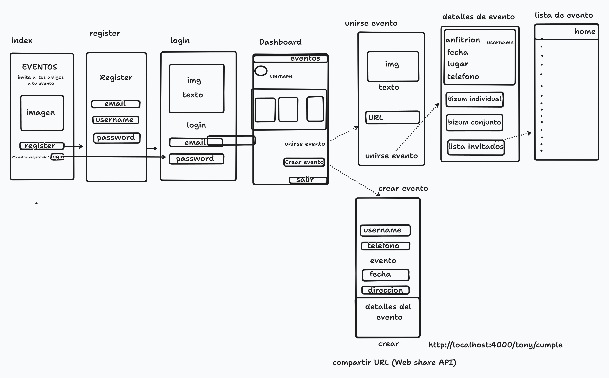

# Aplicación de Gestión de Eventos
Una aplicación para eventos, bodas, bautizos, cumpleaños y fiestas donde en esa aplicación se va a utilizar para que los usuarios de dichos eventos se pongan de acuerdo si regalar algo individualmente o en conjunto, o si cada usuario quiere enviar un Bizzum al anfitrión de cada evento. Cada invitado debe registrarse en la aplicación mediante una invitación del anfitrión creador para que les llegue al correo y puedan registrarse mediante una URL de la página del evento.

En la página principal, quiero hacer un navbar con un campo de invitados para que el anfitrión pueda poner los campos de invitado, otro de registro de eventos con un desplegable de los tipos de eventos: bodas, bautizos, comunión, cumpleaños y fiestas. Cada campo tendrá su propia imagen de fondo, pero con los mismos campos. Tanto el anfitrión como los invitados podrán ver la lista de invitados de cada evento que se haya creado, con la fecha del evento y la hora.
## Index  
-	### público
	Como usuario al acceder a la aplicación encontraremos un título con una descripción.
	Donde aparecerá una imagen de la aplicación y debajo dos botones una para registrarse que te llevara a la pagina de registro si no estas registrado y si estas registrado tendremos otro botón que nos llevara a la pagina de login
## Login
Tendrá una imagen de la aplicación con dos campos que requiere email y password y nos llevara a Dashboard
Registro

 ## Dashboard
### Privado
saldrá un navbar en la parte superior con los eventos que saldrán en un desplegable  debajo a la izquierda saldrá el nombre del usuario  luego debajo del nombre del usuario saldrán los eventos que haya creado el usuario con toda la información del evento creado, tendremos un botón  que será para crear eventos unirse eventos y botón de salir el de crear eventos nos llevara a crear eventos y unirse a eventos a dicha pagina 

## Crear evento 
Pediremos información al usuario como nombre, fecha, evento teléfono, dirección y descripción del evento con un botón de crear y otro para compartir URL creada esta URL se genera una vez que el usuario le dé al botón de crear que devolvería   por ejemplo (http://localhost:4000/user/tony/gfgpoker)  esta URL se podrá enviar a los usuarios mediante (web share API)
## Unirse a evento
Tendremos una imagen de la aplicación con texto debajo tendremos para pegar la URL que nos allá pasado el usuario creador con un botón para unirse a dicho evento una vez que  le demos nos llevara a detalles de eventos 
## Detalles de evento 
En detalles de evento tendremos la información del anfitrión como nombre, evento, fecha ,lugar y teléfono  tendremos 3 botones uno para hacer bizum conjunto otro individual y otro para ver la lista de todos los usuarios que han sido invitados 
## Lista de invitados
Saldrán todos los usuarios que han sido invitados con un navbar para redirigir a Dashboard

 ## Vista

 

 # backend
 ## tablas
  que necesitaremos son users, eventos y invitaciones  

 ## Tabla de Usuarios:

ID uuid (clave primaria),
username (sera text not null),
email (sera text not null unique),
password (sera text not null),
fecha (para saber cuando se registro)

## Tabla de Eventos:

ID uuid (clave primaria),
evento (text not null),
Fecha (date  para almacenar fechas),
Hora (time para almacenar la hora),
Teléfono (text not null) ,
Dirección (text not null),
Descripción_evento(text not null),
Contraseña_evento (donde se almacenará la contraseña generada automáticamente),
ID_usuario (clave externa que hace referencia al usuario anfitrión en la tabla de Usuarios)

## Tabla de Invitaciones:

ID uuid (clave primaria),
confirmación (por ejemplo, aceptado, pendiente, rechazado),
pago_Bizum (opcional, si se requiere registrar para el pago),
Estado_Bizum(opcional para registrar el estado del pago),
invitacion_evento (clave externa que hace referencia al evento en la tabla de Eventos),
usuario_invitado (clave externa que hace referencia al usuario invitado en la tabla de Usuarios)